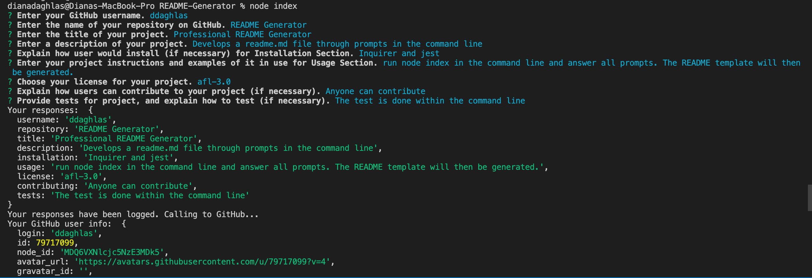
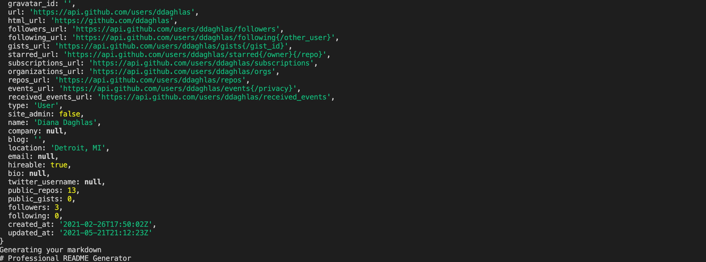
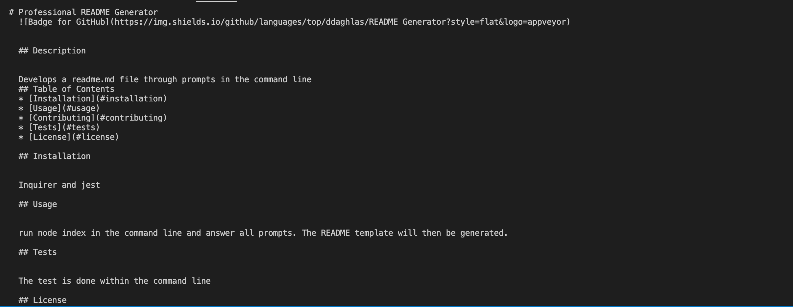
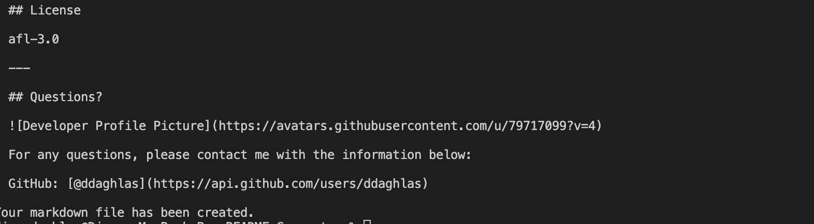

# Professional README Generator

## Description
- A developers GitHub profile is an extremely important aspect of their public identity as a professional web developer. A well-crafted profile allows one to show off their work to other developers as well as potential employers. An important component of a GitHub profile that is overlooked by many new developers is the README.md file. 
- The quality of a README often differentiates a good project from a bad project. A good one takes advantage of the opportunity to explain and showcase what the application does, justify the technologies used, and discuss challenges faced and features that may be implemented in the future. A good README allows one to stand out amongst a sea of developers displaying their own work on GitHub. 
- A good README should include a title and a short description explaining the what, why, and how. What was the project motivation? Why did you build this project? What problem does it solve? What did you learn? What makes your project stand out? 
- You can quickly and easily create a README file by using a command-line application to generate one. This allows the project creator to devote more time to working on the project.

  ## Table of Contents
  * [Installation](#installation)
  * [Usage](#usage)
  * [Contributing](#contributing)
  * [Tests](#tests)
  * [License](#license)

   ## Installation
  
  
  GIVEN a command-line application that accepts user input - WHEN I am prompted for information about my application repository, THEN a quality, professional README.md is generated with the title of your project and sections entitled Description, Table of Contents, Installation, Usage, License, Contributing, Tests, and Questions. WHEN I enter my project title, THEN this is displayed as the title of the README. WHEN I enter a description, installation instructions, usage information, contribution guidelines, and test instructions, THEN this information is added to the sections of the README entitled Description, Installation, Usage, Contributing, and Tests. WHEN I choose a license for my application from a list of options, THEN a badge for that license is added hear the top of the README and a notice is added to the section of the README entitled License that explains which license the application is covered under. WHEN I enter my GitHub username, THEN this is added to the section of the README entitled Questions, with a link to my GitHub profile. WHEN I enter my email address, THEN this is added to the section of the README entitled Questions, with instructions on how to reach me with additional questions. WHEN I click on the links in the Table of Contents, THEN I am taken to the corresponding section of the README.
  
  ## Usage 
  -   A command-line application that dynamically generates a professional README.md from a user's input using the [Inquirer package](https://www.npmjs.com/package/inquirer). Review the [Good README guide](../../01-HTML-Git-CSS/04-Important/Good-README-Guide/README.md) as a reminder of everything that a quality, professional README contains. The application will be invoked with the following command: node index.   
  - Screenshots:
  
  
  
  
  <!--    -->
  
  ## Contributing
  
  
  Contributions are accepted. Feel free to fork.
  
  ## Tests
  
  
  Answer all questions and check returned inputs.
  
  ## License
  
  mit
  
  ---
  
  ## Questions?
  
  For any questions, please contact me with the information below:

  GitHub: [@ddaghlas](https://api.github.com/users/ddaghlas) 